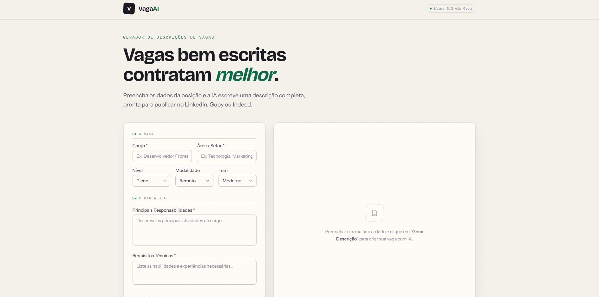
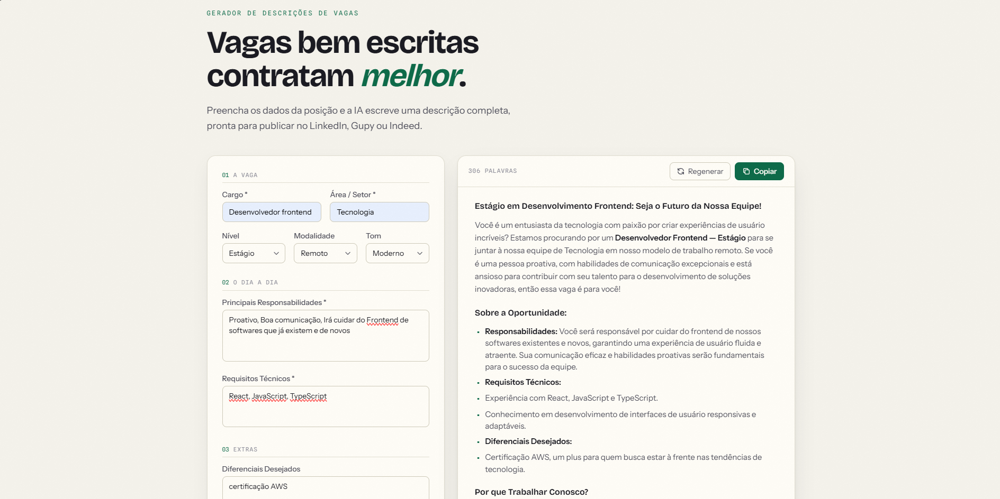

<div align="center">

# VagaAI

**Descrições de vagas profissionais em segundos, geradas com IA.**

[](https://vagaai-demo.vercel.app)

[](https://github.com/leomoraessantdev/VagaAI/actions/workflows/ci.yml)


</div>

VagaAI usa a API da Groq (Llama 3.3 70B) para gerar descrições de vagas completas e profissionais a partir de um formulário simples. Ideal para RH, recrutadores e fundadores que precisam publicar vagas no LinkedIn, Gupy ou Indeed rapidamente.

## Funcionalidades

- Formulário guiado com nível, modalidade e tom da descrição
- Streaming em tempo real — o texto aparece enquanto a IA escreve (SSE)
- Resultado formatado (títulos, negrito e listas) pronto para copiar
- Copiar inteligente: rich text para editores e texto puro sem markdown para LinkedIn/Gupy
- Regenerar com variação real — o modelo recebe a versão anterior e evita repeti-la
- Histórico das últimas gerações salvo localmente (localStorage), com regeneração a partir dele
- Rate limiting, validação de payload e CORS restrito no backend

## Screenshots





## Tecnologias

| Camada | Stack |
|---|---|
| Frontend | React 19, TypeScript, Tailwind v4, Vite |
| Backend | Node.js 20, Express, TypeScript |
| IA | Llama 3.3 70B via Groq SDK |
| Deploy | Vercel (frontend estático + backend serverless) |
| Testes | Vitest + RTL (frontend), Jest + Supertest (backend) |

## Como Rodar Localmente

### Pré-requisitos

- Node.js 20+
- Chave de API da Groq ([console.groq.com](https://console.groq.com) — gratuita)

### Backend

```bash
cd backend
cp .env.example .env
# Edite .env e adicione sua GROQ_API_KEY
npm install
npm run dev
```

Backend disponível em `http://localhost:3001`

### Frontend

```bash
cd frontend
npm install
npm run dev
```

Frontend disponível em `http://localhost:5173`

## Deploy

Os dois lados rodam na Vercel — o frontend como site estático (Vite) e o backend
como serverless function (`backend/api/index.ts` exporta o app Express).

### Frontend → Vercel

```bash
cd frontend
vercel link
vercel env add VITE_API_URL production   # URL do backend
vercel --prod
```

### Backend → Vercel

```bash
cd backend
vercel link
vercel env add GROQ_API_KEY production
vercel env add ALLOWED_ORIGINS production  # URL do frontend
vercel --prod
```

### Alternativa: Backend → Render

O backend também roda como servidor tradicional (o `app.listen` só é
desativado quando `VERCEL` está definido no ambiente):

1. Crie um **Web Service** no [render.com](https://render.com)
2. **Root Directory:** `backend` · **Build:** `npm install && npm run build` · **Start:** `npm start`
3. **Environment Variables:** `GROQ_API_KEY` e `ALLOWED_ORIGINS`

## Estrutura do Projeto

```
vagaai/
├── frontend/              # React + Vite + TypeScript + Tailwind
│   └── src/
│       ├── components/    # Header, JobForm, ResultArea, History
│       ├── hooks/         # useHistory (localStorage)
│       ├── lib/           # api.ts (fetch + SSE), markdown.tsx
│       └── types/         # Tipos TypeScript compartilhados
├── backend/               # Node.js + Express + TypeScript
│   └── src/
│       ├── routes/        # POST /api/gerar-vaga
│       ├── lib/           # buildPrompt (geração do prompt)
│       └── types/         # Tipos TypeScript compartilhados
└── README.md
```

## Licença

MIT
