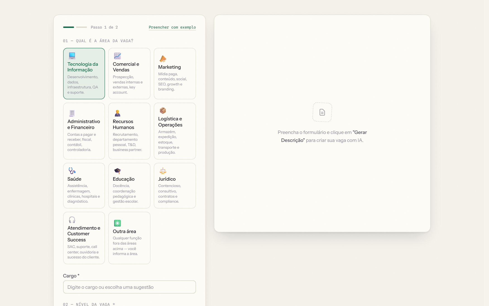
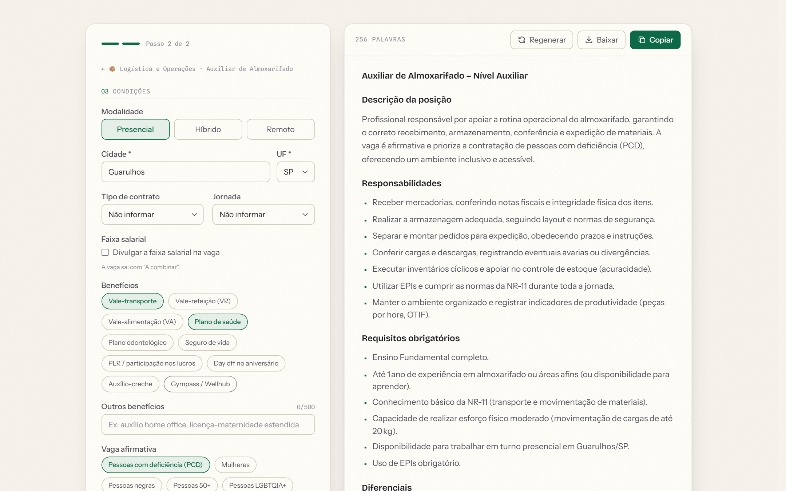

<div align="center">

# VagaAI

**Descrições de vagas profissionais em segundos, geradas com IA.**

[](https://vagaai-demo.vercel.app)

[](https://github.com/leomoraessantdev/VagaAI/actions/workflows/ci.yml)


</div>

VagaAI usa a API da Groq para gerar descrições de vagas completas e profissionais a partir de um formulário curto. Cobre **10 áreas profissionais** — de desenvolvimento de software a chão de fábrica — cada uma com sua escala de senioridade real, vocabulário próprio e campos específicos. Ideal para RH, recrutadores e fundadores que precisam publicar vagas no LinkedIn, Gupy ou Indeed rapidamente.

## Funcionalidades

**Multi-área**

- 10 áreas profissionais + "Outra área" com campo livre e template genérico
- Escala de senioridade **real de cada área** — Tech Lead em TI, Encarregado em logística,
  SDR/BDR em vendas, Advogado Pleno no jurídico, Professor Especialista em educação
- Vocabulário próprio por área no prompt: uma vaga de Auxiliar de Almoxarifado fala de
  expedição, EPIs e acuracidade de estoque, nunca de stack ou code review
- Campos exclusivos por área: CNH e NRs em logística, registro no conselho em saúde,
  OAB no jurídico, nível de ensino em educação, modelo de remuneração em vendas

**Formulário**

- Fluxo em 2 passos: área, cargo e nível primeiro; detalhes depois
- Seleção de área em grade de cards, combobox de cargo com sugestões e digitação livre
- Só 3 campos são obrigatórios — o que faltar, a IA deduz a partir do cargo e do nível
- Campos que recrutador brasileiro precisa: modalidade e local, tipo de contrato, jornada
  (incluindo 6x1 e 12x36), faixa salarial com toggle de divulgação, benefícios padrão BR,
  vaga afirmativa (PCD, mulheres, pessoas negras, 50+, LGBTQIA+)

**Conformidade**

- Aviso não bloqueante quando o texto livre contém requisito potencialmente discriminatório
  (idade, sexo, estado civil, filhos, aparência, gravidez, religião, raça)
- O prompt instrui o modelo a não reproduzir esse tipo de exigência (Lei 9.029/95 e CLT)
- Linguagem neutra de gênero como opção, ligada por padrão
- O modelo é proibido de inventar empresa, salário ou benefício que não foi informado

**Geração**

- Streaming em tempo real — o texto aparece enquanto a IA escreve (SSE)
- Estrutura de saída consistente entre áreas, em 9 seções
- Preset de plataforma: ajusta a formatação para LinkedIn, Gupy ou Indeed
- Copiar inteligente (rich text e texto puro) e download em .txt
- Regenerar com variação real — o modelo recebe a versão anterior e evita repeti-la
- Histórico local com migração automática de entradas da versão anterior do app
- Cancelamento da geração em andamento (o texto parcial é mantido)
- Tema claro/escuro com preferência salva e detecção do tema do sistema
- Rate limiting, validação zod do payload e CORS restrito no backend

## Adicionar uma área nova

Todo o formulário se monta a partir de `GET /api/areas`. Para acrescentar uma área,
crie um arquivo em `backend/src/data/areas/` e registre-o no `index.ts`:

```ts
// backend/src/data/areas/engenharia.ts
export const engenharia: AreaConfig = {
  id: 'engenharia',
  label: 'Engenharia',
  icon: '🏗️',
  descricao: 'Civil, mecânica, elétrica e produção.',
  seniorityLevels: [{ id: 'junior', label: 'Engenheiro(a) Júnior', yearsHint: 'até 2 anos' }],
  commonRoles: ['Engenheiro(a) Civil', 'Engenheiro(a) de Produção'],
  skillLabel: 'Ferramentas e normas técnicas',
  skillPlaceholder: 'Ex: AutoCAD, Revit, NBR 6118',
  extraFields: [{ id: 'crea', label: 'Registro no CREA', tipo: 'select', opcoes: [/* ... */] }],
  promptGuidance: 'Use o vocabulário de engenharia: memorial descritivo, ART, cronograma físico-financeiro...',
};
```

Nenhum componente de UI, schema de validação ou trecho de prompt precisa ser tocado:
a grade de áreas, a escala de senioridade, os campos extras e a validação zod são
todos derivados do registry.

## Screenshots





## Tecnologias

| Camada | Stack |
|---|---|
| Frontend | React 19, TypeScript, Tailwind v4, Vite |
| Backend | Node.js 20, Express, TypeScript |
| IA | gpt-oss-120b via Groq SDK |
| Deploy | Vercel (frontend estático + backend serverless) |
| Testes | Vitest + RTL (frontend), Jest + Supertest (backend) |

## Como Rodar Localmente

### Pré-requisitos

- Node.js 20+
- Chave de API da Groq ([console.groq.com](https://console.groq.com) — gratuita)

### Backend

```bash
cd backend
cp .env.example .env
# Edite .env e adicione sua GROQ_API_KEY
npm install
npm run dev
```

Backend disponível em `http://localhost:3001`

### Frontend

```bash
cd frontend
npm install
npm run dev
```

Frontend disponível em `http://localhost:5173`

## Deploy

Os dois lados rodam na Vercel — o frontend como site estático (Vite) e o backend
como serverless function (`backend/api/index.ts` exporta o app Express).

### Frontend → Vercel

```bash
cd frontend
vercel link
vercel env add VITE_API_URL production   # URL do backend
vercel --prod
```

### Backend → Vercel

```bash
cd backend
vercel link
vercel env add GROQ_API_KEY production
vercel env add ALLOWED_ORIGINS production  # URL do frontend
vercel --prod
```

### Alternativa: Backend → Render

O backend também roda como servidor tradicional (o `app.listen` só é
desativado quando `VERCEL` está definido no ambiente):

1. Crie um **Web Service** no [render.com](https://render.com)
2. **Root Directory:** `backend` · **Build:** `npm install && npm run build` · **Start:** `npm start`
3. **Environment Variables:** `GROQ_API_KEY` e `ALLOWED_ORIGINS`

## Limitações Conhecidas

- **Rate limiting em serverless é melhor-esforço.** O `express-rate-limit` guarda os
  contadores na memória do processo; na Vercel, cada instância serverless (e cada cold
  start) começa zerada. Na prática o limite funciona como fricção contra abuso casual,
  não como proteção rígida. Para garantia real seria necessário um armazenamento
  compartilhado entre instâncias (ex.: Upstash Redis) — fora do escopo desta demo.

## Estrutura do Projeto

```
vagaai/
├── frontend/              # React + Vite + TypeScript + Tailwind
│   └── src/
│       ├── components/    # AreaPicker, CargoCombobox, PassoIdentificacao,
│       │                  # PassoDetalhes, ExtraFields, AvisoConformidade, ResultArea
│       ├── hooks/         # useRegistry (GET /api/areas), useHistory (localStorage)
│       ├── lib/           # api.ts (fetch + SSE), conformidade.ts, markdown.tsx
│       └── types/         # Espelho do que GET /api/areas devolve
├── backend/               # Node.js + Express + TypeScript
│   └── src/
│       ├── data/
│       │   ├── areas/     # Registry: um arquivo por área (fonte de verdade)
│       │   └── catalogos.ts  # Modalidade, contrato, jornada, benefícios, UFs
│       ├── routes/        # GET /api/areas · POST /api/gerar-vaga
│       ├── lib/           # buildPrompt (composição) e schema (zod do registry)
│       └── types/         # Tipos do payload da vaga
└── README.md
```

## Como o prompt é montado

O prompt final é composto, não é um template único:

```
base comum  →  dados do formulário  →  orientação da área  →  estilo e linguagem
            →  conformidade legal   →  formato de saída    →  preset de plataforma
```

## Licença

MIT
